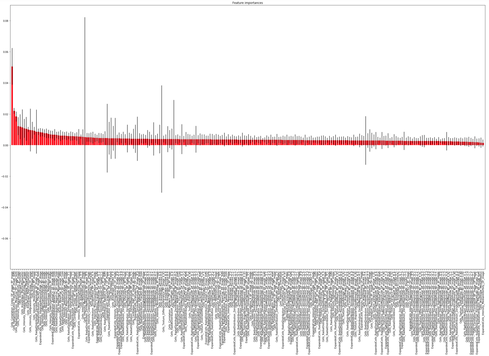
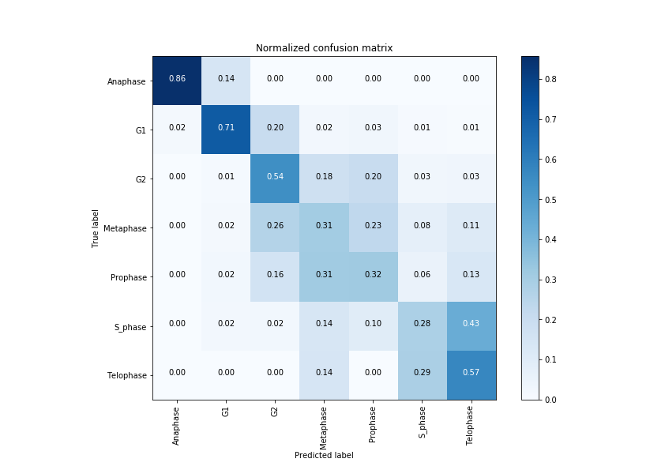
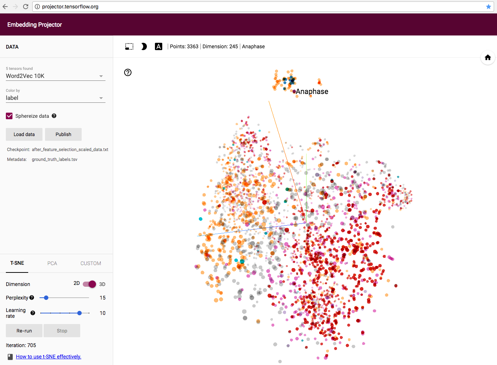

# Machine learning pipeline for CellProfiler output

This is a vignette of performing supvervised and unsupervised classification of cellular phenotypes, as a downstream step from CellProfiler analysis (output as SQLite database)

# Installation

Core requirement: [CellProfiler](http://cellprofiler.org) 2.2+, Python and its machine learning libraries Scikit-learn

1. Install [Python](https://www.python.org/downloads/) (>=2.7.9 or >=3.4)

    In case you already had older version of Python that does not include pip, and you do not wish to upgrade, please follow the instruction [here](https://packaging.python.org/tutorials/installing-packages/)
    
    **Note:**
    
    Windows user may need to add python installation folder to the %PATH variable. Here is a powershell script to do it. BE SURE TO ADD THE ";" before adding the new path.
    
    ```
    $ [Environment]::SetEnvironmentVariable("Path", $env:Path + ";C:\Users\<username>\AppData\Roaming\Python\Python35\Scripts", [EnvironmentVariableTarget]::User)

    ```
 
1. Open a command line window
    
    In Linux/Mac OS, open the "Terminal".
    
    In Windows, open the "cmd" (as administrator) here's [how-to](https://www.howtogeek.com/235101/10-ways-to-open-the-command-prompt-in-windows-10/). Windows user may also have to first navigate to:
       
       cd C:\Users\YOUR_USER_NAME\AppData\Local\Programs\Python\Python36\Scripts

1. In Terminal/cmd, type :
    ``` r
    pip3 install --upgrade pip
    ```
    In OSX/Linux you may have to use "sudo", e.g: 
    ``` r
    sudo pip3 install --upgrade pip
    ```
    If you prefer to use Python 2, then run with "pip" instead of "pip3", e.g.: 
    ``` r
    sudo pip install --upgrade pip
    ```

1. If success, continue to run the following commands, one line at a time:
    ``` r
    pip3 install numpy
    pip3 install scipy
    pip3 install sklearn
    pip3 install pandas
    pip3 install matplotlib
    pip3 install jupyter
    ```
    
    **Note:** 
    
    Windows user may need to manually download numpy package from [this website](http://www.lfd.uci.edu/~gohlke/pythonlibs/#numpy)
    ```
    cd C:\Users\YOUR_USER_NAME\AppData\Local\Programs\Python\Python36\Scripts
    pip3 install /YOUR_download_location/<package-name>.whl
    ```
1. Once done, test if you can use jupyter notebook. In Terminal or cmd, type:
    ``` r
    jupyter notebook
    ```
    If it opens an interface in your default web-browser, you’re ready!

    If you have issues running jupyter, please visit [Jupyter website](https://jupyter.readthedocs.io/en/latest/install.html)

    If jupyter notebook is not available, the vignette can still be used in command line (see **Use**)
    
# Use

1. Feature extraction by CellProfiler   
    
    Starting from raw images input, you will first need to perform [CellProfiler](http://cellprofiler.org) analysis on those images.  In this vignette, you can use the example pipeline located at **CPpipeline**/*cellcycle.cppipe* to analyze the example images provided in folder **images**. Read [more](https://github.com/minh-doan/MLCP/tree/master/images) about these images and the study.
    
    **Input of this step:** 
       
       * raw images
    
    **Output of this step:** 
       
       * SQLite database .DB files (preferably, see note)    
    
    **Note 1:**
    
    To validate the result of classification, each object often needs to be labelled with a class name. In this example, the objects are automatically labelled according to the names of the immediate folders containing its images. In CellProfiler terminology, it's called *Image_Metadata_folder*.
    
    For instance, a folder structure of a drug screen:

    ```
    └── Experiment_7817
        └── Positive_control
            └── B12_s1_w1.tif
            └── B12_s1_w2.tif
            └── B13_s1_w1.tif
            └── B13_s1_w2.tif                                  
        └── Treatment_1
            └── A1_s1_w1.tif
            └── A1_s1_w2.tif
            └── A3_s1_w1.tif
            └── A3_s1_w2.tif      
    ```
    
    Here *Positive_control* and *Treatment_1* will be used as the labels for any identified objects from the images of wells "B" and "A", respectively. The regular expression rule used in CellProfiler pipeline will look for the prefix *"Experiment"* as in "Experiment_7817" of the parental folder. You can tune CellProfiler pipeline to fit your own use of metadata.
    
    **Note 2:**
    
    The machine learning script at its current stage will need to be placed in a folder at the same level with the CellProfiler output folder, i.e. “CPOut”. 
    
    ```
    └── MLCP
        └── CPOutput
            └── DefaultDB_train.db
            └── DefaultDB_test.db
        └── MachineLearning
            └── MLCP.py
            └── MLCP.ipynb    
    ```
    The script will also look for files named *DefaultDB_train.db* and *DefaultDB_test.db* , which are SQLite databases, inside **CPOut**. Please consider this if you need to change the name of the output folder, and name and type of CellProfiler output database. If you wish, you can change these path and names easily by editing the script itself using any text editor.
    
    If you prefer to use .CSV outputs, please visit another [vignette](https://github.com/holgerhennig/machine-learning-IFC) of the same work.
    
1. Feature selection

    CellProfiler may extract large number of features. For classical machine learning, it is advisable to first remove the zero-variance features (same values for every objects) as well as redundant features (highly correlated features). This preprocessing step is demonstrated in the first part of **MachineLeaning**/*MLCP.ipynb* using tree-based feature selection method. You can easily modify this module to use any other feature selection methods.
    
    **Input of this step:** 
       
       * SQLite database .DB files (from step 1)
    
    **Output of this step:** 
       
       * Histogram of feature ranking (.PNG)
       * Data table of objects with selected features (.TXT files)
       * Metadata labels of objects (.TSV file)
    
    <p align="center"></p>
    
    Alternatively, [Cytominer](https://github.com/cytomining/cytominer) is an R package that can perform various preprocessing tasks for large morphological profilling data. You are encouraged to visit its example use [here](https://github.com/cytomining/cytominer/blob/master/vignettes/cytominer-pipeline.Rmd)
    
1. Supervised learning / classification

    Preprocessed feature space can then be used to predict the cellular phenotypes, as demonstrated in the later part of **MachineLeaning**/*MLCP.ipynb*. 
    
    **Note :** Supervised classification typically requires ground-truth annotation. In this example, the cells are manually sorted into folders with names correspond to the phases of cell cycle. CellProfiler pipeline can be tuned to automatically collect the names of these folders as ground-truth labels of the cells.
    
    **Input of this step:** 
    
       * preprocessed feature space (from step 2) 
    
    **Output of this step:** 
    
       * Plot of the recalls (.PNG), i.e. percent of cells correctly classified
       * Confusion matrix (.PNG and .TXT) 
       * Weights of the trained models (.SAV)

    <p align="center"></p>

    **Note :** This task can be computationally heavy, depends on how large your data is. Please save your current works, free your computer CPU and memory before running the script.

    To run the script (for step 2 and 3), use Jupyter notebook for **MachineLeaning**/*MLCP.ipynb* 

    ``` r
    jupyter notebook
    ```
    
    or command line for **MachineLeaning**/*MLCP.py* (if jupyter is not available):
 
    ``` r
    cd /path_to_YOUR_folder/MachineLearning
    python MLCP.py
    ```   

1. Unsupervised learning

    Preprocessed feature space can also be used for unsupervised learning. In this example, we project the cells with selected features into t-SNE and PCA plots, which can be interactively visualized at http://projector.tensorflow.org
    
    This projector plot can also be used as a tool to isolate the cluster of objects-of-interest for further analysis.
    
    **Input of this step:** 
       
       * Data table of objects with selected features (.TXT files) (from step 2)
       * Metadata labels of objects (.TSV file) (from step 2)
    
    **Output of this step:** 
       
       * t-SNE / PCA plots on a web-browser at http://projector.tensorflow.org   

    <p align="center"></p>
